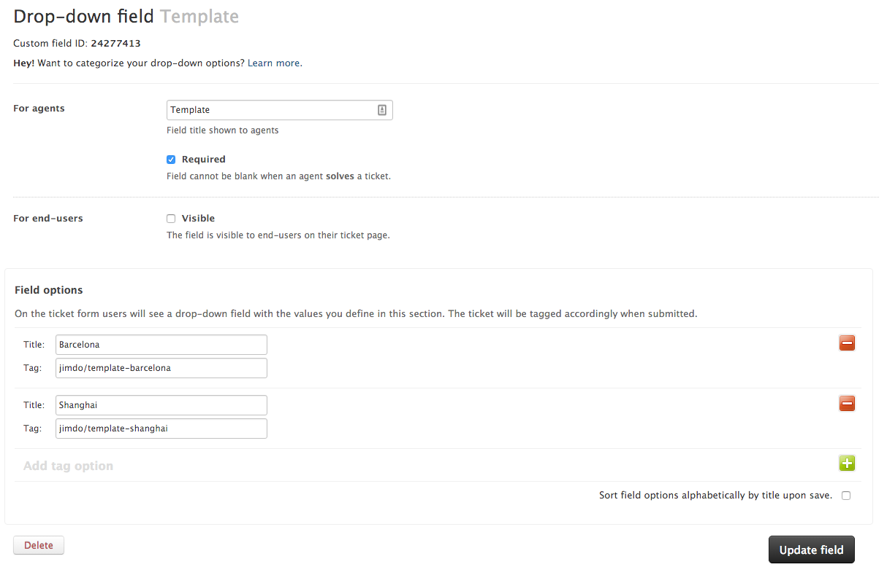
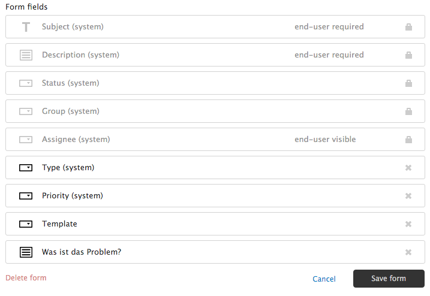
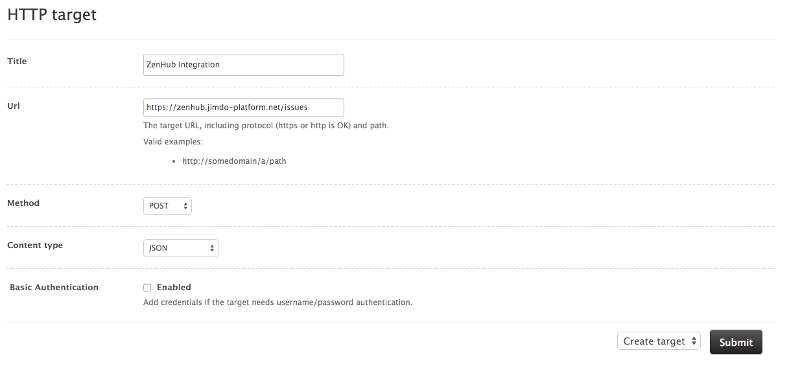
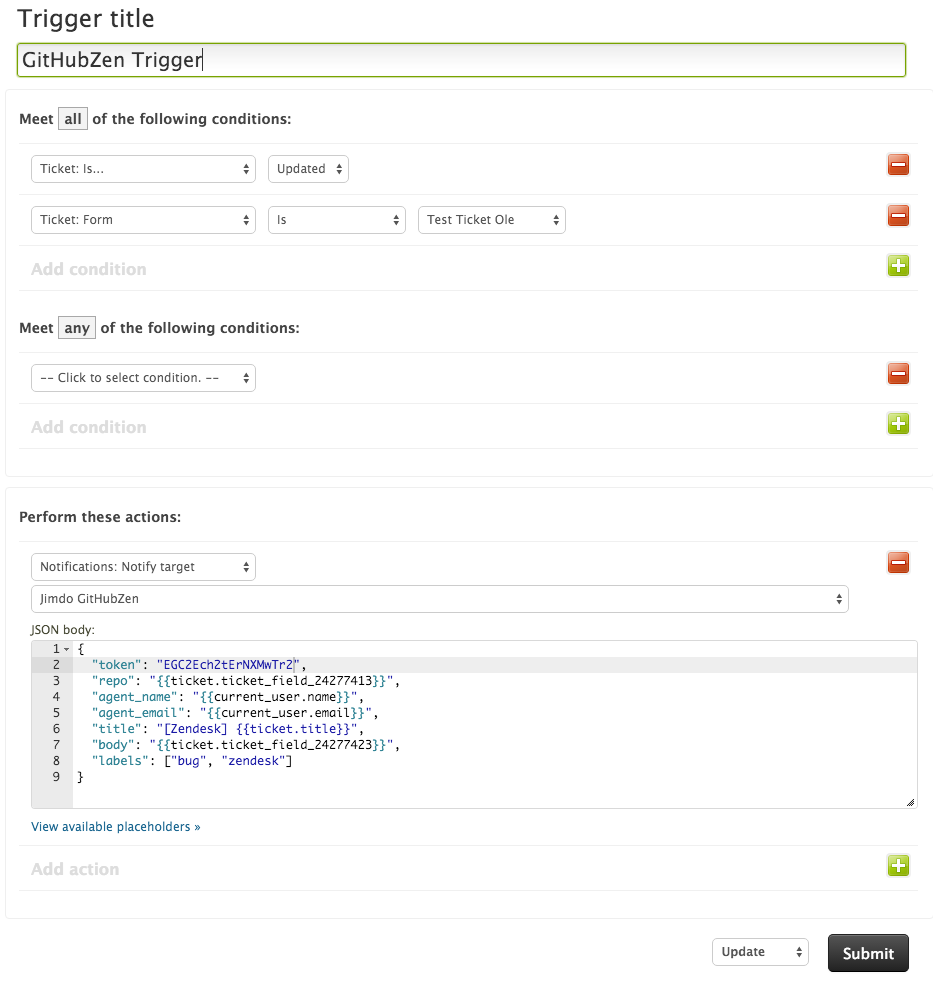
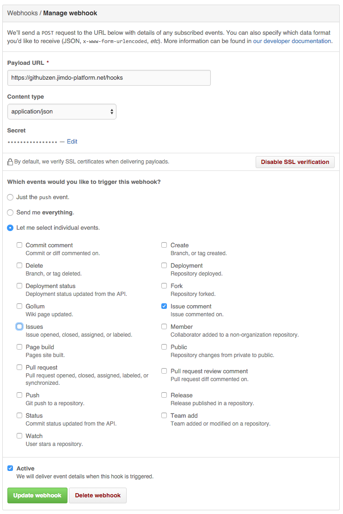

# GitHubZen
A bridge between Zendesk and GitHub issues. Your support team can open issues without the hassle!

## Features:
GitHubZen makes a connection between your support team using Zendesk and your developers using GitHub. A custom `Trigger` in Zendesk triggers a `Extension HTTP target` to the GitHubZen app. This trigger uses data out of custom `ticket form`. The GitHubZen app, then creates a GitHub issue.

## Configure
The configuration on GitHubZen consists of several steps in both tools, as described in the following:

### Zendesk

The configuration of GitHubZen is a bit cumbersome at the moment. With the following steps you should end up with a working flow. In your Zendesk admin interface follow these steps:

1. #### Create Ticket Fields & combine to Ticket Form

   Go to `Settings` -> `Ticket Forms` and `add custom field` and configure the a input form to match your repository string.

   

   Afterwards go to `Settings` -> `Ticket Fields` and `Add form` and configure the form to your needs.

   

1. #### Add HTTP target

  Go to `Settings` -> `Extension` and `add target` -> `HTTP target`

  
1. #### Trigger

  GitHubZen expects to receive the following json

  ```js
  {
    "token": "EGC2Ech2tErNXMwTr2",
    "ticket_id": 272159,
    "repo": "Jimdo/template-chicago",
    "agent_name": "Hannah V. Glock",
    "agent_email": "hannah@jimdo.com",
    "title": "Move logo 3px right",
    "body": "The logo has shifted, the customer would love to see that corrected.", // markdown supported
    "labels": ["bug", "zendesk"]
  }
  ```

  In Zendesk this would look link this:

  ```json
  {
    "token": "EGC2Ech2tErNXMwTr2",
    "repo": "{{ticket.ticket_field_24277413}}",
    "agent_name": "{{current_user.name}}",
    "agent_email": "{{current_user.email}}",
    "title": "[Zendesk] {{ticket.title}}",
    "body": "{{ticket.ticket_field_24277423}}",
    "labels": ["bug", "zendesk"]
  }
  ```

  You can create this Trigger via `Settings` -> `Triggers` and `add trigger` to configure it to look like this:

  

### GitHub
Generate a [Personal access token](https://github.com/settings/tokens) for the users that will create the Zendesk tickets in GitHub. And put the token in the GitHubZen environment.

1. #### Repo hooks

  Create a new webhook in every repository you have added in Zendesk. Make sure to enable `Issue comment` everything else will be discarded.

  

## Deployment
We provide a production ready [docker container](https://hub.docker.com/r/jimdo/githubzen/).

The application expects the following environment variables.
```
PORT=34567
TOKEN=EGC2Ech2tErNXMwTr2
GITHUB_TOKEN=aaa9db106ab0faca9cd529f466508b1b4de485e1
ZENDESK_URL=https://acme.zendesk.com/api/v2
ZENDESK_USERNAME=support@acme.com
ZENDESK_TOKEN=a6df7y45a9ugh89sdfy79sdfg89y
```

## Feature Wishlist:
- Create Zendesk configuration with rake task
- Create Github webhook on Zendesk request
